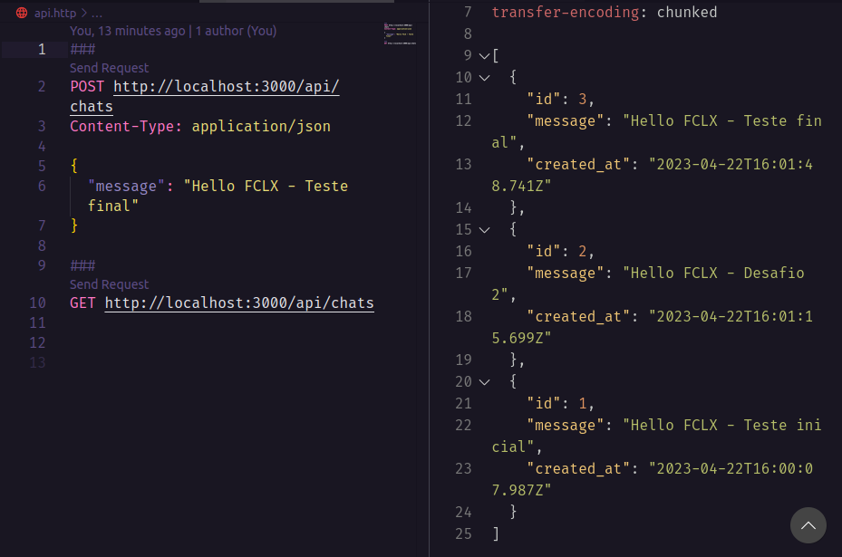
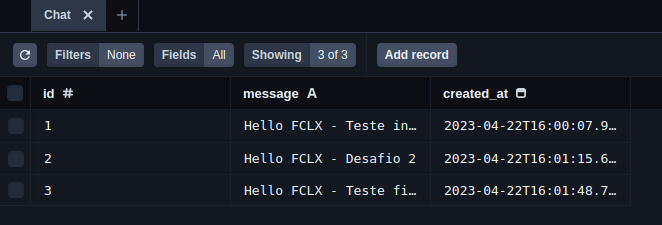

<div align="center" id="top"> 
  <h1>FCLX - Desafio 2</h1>
  <h2>API Routes Next.js</h2>
  
  <br>
  <br>
  <h2>Database - SQLite</h2>
  
  <br>
  <br>

</div>

<p align="center">
  

  

  

  
 
</p>

<p align="center">
  <a href="#dart-about">About</a> &#xa0; | &#xa0;   
  <a href="#rocket-technologies">Technologies</a> &#xa0; | &#xa0;
  <a href="#white_check_mark-requirements">Requirements</a> &#xa0; | &#xa0;
  <a href="#checkered_flag-starting">Starting</a> &#xa0; | &#xa0;
  <a href="#memo-license">License</a> &#xa0; | &#xa0;
  <a href="https://github.com/wsasouza" target="_blank">Author</a>
</p>

<br>

## :dart: About

Objetivo:
Criar uma aplicação Next.js com Docker que rode na porta 3000.
Expor 2 rotas de API Rest:

- Criar chat - POST /api/chats

- Listar chats - GET /api/chats

Um chat tem 2 dados, o ID é auto-incrementado e a mensagem que é string.

O Next.js precisa salvar e buscar os dados do banco de dados usando o Prisma, o banco de dados a ser utilizado precisa ser o SQLite e precisa ser commitado no projeto.

Crie o arquivo api.http para declarar as 2 chamadas a serem realizadas.

## :rocket: Technologies

The following tools were used in this project:

- [Docker](https://www.docker.com/)
- [Node.js](https://nodejs.org/en/)
- [React](https://pt-br.reactjs.org/)
- [Next.js](https://nextjs.org/)
- [TypeScript](https://www.typescriptlang.org/)

## :white_check_mark: Requirements

Before starting :checkered_flag:, you need to have [Git](https://git-scm.com) and [Node](https://nodejs.org/en/) installed.

## :checkered_flag: Starting

```bash
# Clone this project
$ git clone https://github.com/wsasouza/fclx-desafio-2

# Access
$ cd fclx-desafio-2

# Install dependencies
$ npm install

# Run the project
$ npm run dev

# The server will initialize in the <http://localhost:3000>
```

## :memo: License

This project is under license from MIT. For more details, see the [LICENSE](LICENSE.md) file.

Made with :heart: by <a href="https://github.com/wsasouza" target="_blank">Walter Santos de Andrade Souza</a>

&#xa0;

<a href="#top">Back to top</a>
